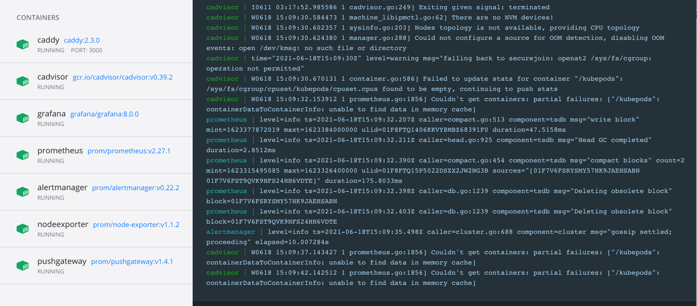

# BillionMining
>BillionMining:Artificial intelligence and data warehouse framework based on flink <br/>
基于flink的人工智能和数据仓库项目

> It may be an enterprise level real-time recommendation data feature processing system and real-time data warehouse</br>
可能是一个企业级的实时推荐数据特征处理系统和实时数据仓库

> 源起：在flink meetup上有感，想正好融合一下字节的推荐和快手的数据仓库实践，一点点做呗 </br>
> 男人的真正浪漫永远是创世的快乐


第一步：环境部署
```bash
cd dockerenv
ADMIN_USER=admin ADMIN_PASSWORD=admin ADMIN_PASSWORD_HASH=JDJhJDE0JE91S1FrN0Z0VEsyWmhrQVpON1VzdHVLSDkyWHdsN0xNbEZYdnNIZm1pb2d1blg4Y09mL0ZP docker-compose up -d
```
这是一套综合的监控环境，docker部署，用于监控推荐系统、业务、运维的各类指标。
docker环境包含:
* Prometheus (metrics database) `http://<host-ip>:9090`
* Prometheus-Pushgateway (push acceptor for ephemeral and batch jobs) `http://<host-ip>:9091`
* AlertManager (alerts management) `http://<host-ip>:9093`
* Grafana (visualize metrics) `http://<host-ip>:3000`
* NodeExporter (host metrics collector)
* cAdvisor (containers metrics collector)
* Caddy (reverse proxy and basic auth provider for prometheus and alertmanager)
 
更懂配置项参见 https://gitee.com/lzh_sha/dockprom.git

服务全部启动

grafana服务（3000端口），已经预先配置很多了监控项


记录：
2020.07.01 


